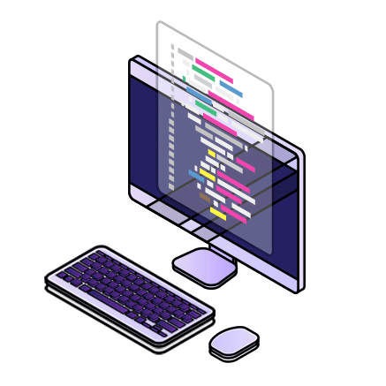

[](https://git.io/typing-svg)

<p align="left">  </p>

<h1>🔔 Social media </h1>
    
[](https://www.linkedin.com/in/devpedrorosa/)
[](mailto:devpedrorosa@gmail.com)


## ABOUT ME:

  </p>

```javascript
let pedrorosa-dev = {
  passion: "I have a great passion for development and my dream is to become a great software engineer",
  developer: [Web Developer, Future Mobile Developer],
  education: [Graduating in Information Systems, "3rd out of 8 semesters"],
  contact: "You can reach me at" devpedrorosa@gmail",
  quote: "As the song goes," "Im only human after all"
};
```

 <hr>
  <p align="center">
  
  
</p>

<br>
 
  
 </div>
<br>
<hr>
  <br>

<div align="center">
    <h4> 💻 Skills</h4>
   <a href="https://skillicons.dev">
    
  </a>
  <div>
    <h4>📚 Studying</h4>
   <a href="https://skillicons.dev">
    
  </a>
  </div>
     <div>
    <h4> 📜 Experience:</h4>
   <a href="https://skillicons.dev">
    
  </a>
  </div>
      <br>
    
</div>   


